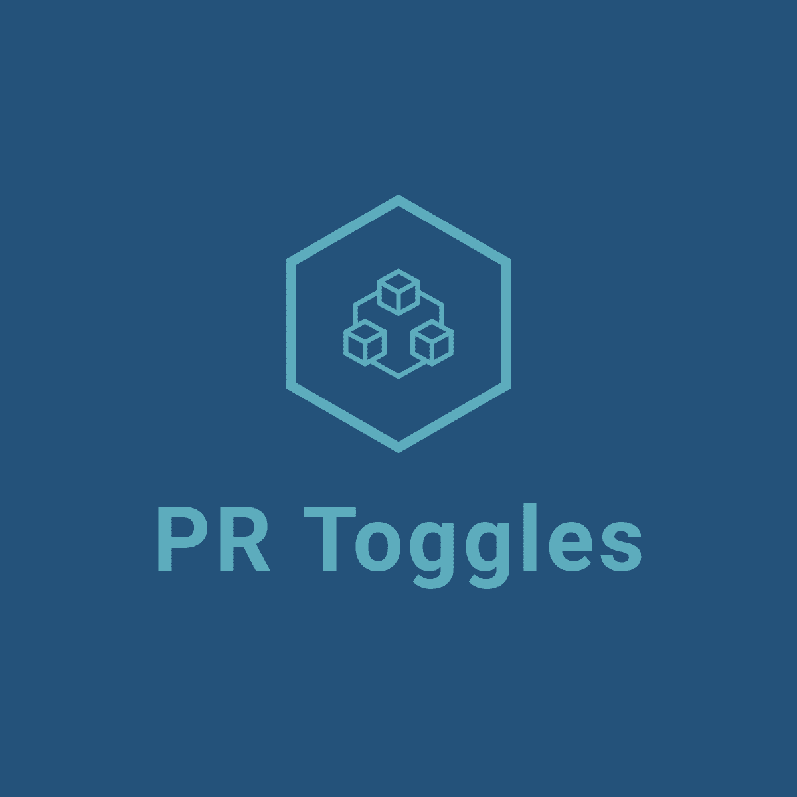

<a name="readme-top"></a>

[![MIT License][license-shield]][license-url]
[![LinkedIn][linkedin-shield]][linkedin-url]


<!-- PROJECT LOGO -->
<br />
<div align="center">
  <a href="https://github.com/patrickdelfim/pr-toggles-frontend">
    
  </a>

  <h3 align="center">PR Toggles</h3>

  <p align="center">
    Painel administrativo para gerenciamento de feature toggles.
    <br />
    <a href="https://github.com/patrickdelfim/pr-toggles-frontend/blob/master/doc/TCC-PRToggles.pdf"><strong>Explore the docs »</strong></a>
    <br />
    <br />
    <a href="https://github.com/patrickdelfim/pr-toggles-frontend">View Demo</a>
    ·
    <a href="https://github.com/patrickdelfim/pr-toggles-frontend/issues">Report Bug</a>
    ·
    <a href="https://github.com/patrickdelfim/pr-toggles-frontend/issues">Request Feature</a>
  </p>
</div>


<!-- ABOUT THE PROJECT -->
## About The Project

![Product Name Screen Shot][product-screenshot]

PR Toggles é um projeto desenvolvido para o trabalho de conclusão da minha graduação. Ele consiste em um sistema de gerenciamento de feature toggles.

Nele é possível o usuário configurar feature toggles para diversos projetos de forma intuitiva e com pouca configuração.


<p align="right">(<a href="#readme-top">back to top</a>)</p>


### Built With

* [![React][React.js]][React-url]
* [![Chackra-ui][Chackra-ui]][Chackra-ui-url]
* <a href="https://miragejs.com/"><strong>Mirage.js</strong></a>
* <a href="https://www.typescriptlang.org/"><strong>Typescript</strong></a>
* <a href="https://www.cypress.io/"><strong>Cypress</strong></a>
* <a href="https://react-query-v3.tanstack.com/"><strong>React-Query</strong></a>
* <a href="https://react-hook-form.com/"><strong>React-Hook-Form</strong></a>

<p align="right">(<a href="#readme-top">back to top</a>)</p>


<!-- GETTING STARTED -->
## Getting Started


### Prerequisites

Para rodar o projeto é necessario ter nodejs e npm instalados.
* npm
  ```sh
  npm install npm@latest -g
  ```

### Installation

1. Clone o repo
   ```sh
   git clone https://github.com/patrickdelfim/pr-toggles-frontend
   ```
2. instale os pacotes NPM
   ```sh
   npm install
   ```
3. Rode o projeto localmente. (A comunicação com o backend foi mockada utilizando o Mirage.js)
   ```sh
   npm run dev
   ```

   3. Acesse o endpoint de entrada abaixo.
   ```sh
   localhost:3000/panel
   ```

<p align="right">(<a href="#readme-top">back to top</a>)</p>


<!-- USAGE EXAMPLES -->
## Usage

Em construção.

<!-- 
Use this space to show useful examples of how a project can be used. Additional screenshots, code examples and demos work well in this space. You may also link to more resources.

_For more examples, please refer to the [Documentation](https://example.com)_

 -->
<p align="right">(<a href="#readme-top">back to top</a>)</p>

<!-- LICENSE -->
## License

Distributed under the MIT License. See `LICENSE.txt` for more information.

<p align="right">(<a href="#readme-top">back to top</a>)</p>


<!-- ACKNOWLEDGMENTS -->
## Acknowledgments

Esse projeto foi fortemente baseado em diversos outros projetos relacionados a feature toggle.

* [Unleash](https://www.getunleash.io/)
* [Flag Smith](https://flagsmith.com/)
* [Growthbook](https://www.growthbook.io/)

<p align="right">(<a href="#readme-top">back to top</a>)</p>


<!-- MARKDOWN LINKS & IMAGES -->
<!-- https://www.markdownguide.org/basic-syntax/#reference-style-links -->
[contributors-shield]: https://img.shields.io/github/contributors/othneildrew/Best-README-Template.svg?style=for-the-badge
[contributors-url]: https://github.com/othneildrew/Best-README-Template/graphs/contributors
[forks-shield]: https://img.shields.io/github/forks/othneildrew/Best-README-Template.svg?style=for-the-badge
[forks-url]: https://github.com/othneildrew/Best-README-Template/network/members
[stars-shield]: https://img.shields.io/github/stars/othneildrew/Best-README-Template.svg?style=for-the-badge
[stars-url]: https://github.com/othneildrew/Best-README-Template/stargazers
[issues-shield]: https://img.shields.io/github/issues/othneildrew/Best-README-Template.svg?style=for-the-badge
[issues-url]: https://github.com/othneildrew/Best-README-Template/issues
[license-shield]: https://img.shields.io/github/license/othneildrew/Best-README-Template.svg?style=for-the-badge
[license-url]: https://github.com/othneildrew/Best-README-Template/blob/master/LICENSE.txt
[linkedin-shield]: https://img.shields.io/badge/-LinkedIn-black.svg?style=for-the-badge&logo=linkedin&colorB=555
[linkedin-url]: https://www.linkedin.com/in/patrickdelfim/
[product-screenshot]: doc/images/Tela%20Painel%20administrativo.png
[Next.js]: https://img.shields.io/badge/next.js-000000?style=for-the-badge&logo=nextdotjs&logoColor=white
[Next-url]: https://nextjs.org/
[React.js]: https://img.shields.io/badge/React-20232A?style=for-the-badge&logo=react&logoColor=61DAFB
[React-url]: https://reactjs.org/
[Vue.js]: https://img.shields.io/badge/Vue.js-35495E?style=for-the-badge&logo=vuedotjs&logoColor=4FC08D
[Vue-url]: https://vuejs.org/
[Angular.io]: https://img.shields.io/badge/Angular-DD0031?style=for-the-badge&logo=angular&logoColor=white
[Angular-url]: https://angular.io/
[Svelte.dev]: https://img.shields.io/badge/Svelte-4A4A55?style=for-the-badge&logo=svelte&logoColor=FF3E00
[Svelte-url]: https://svelte.dev/
[Laravel.com]: https://img.shields.io/badge/Laravel-FF2D20?style=for-the-badge&logo=laravel&logoColor=white
[Laravel-url]: https://laravel.com
[Bootstrap.com]: https://img.shields.io/badge/Bootstrap-563D7C?style=for-the-badge&logo=bootstrap&logoColor=white
[Bootstrap-url]: https://getbootstrap.com
[JQuery.com]: https://img.shields.io/badge/jQuery-0769AD?style=for-the-badge&logo=jquery&logoColor=white
[JQuery-url]: https://jquery.com 
[Chackra-ui]: https://shields.io/badge/chakra--ui-black?logo=chakraui&style=for-the-badge%22
[Chackra-ui-url]: https://chakra-ui.com/
